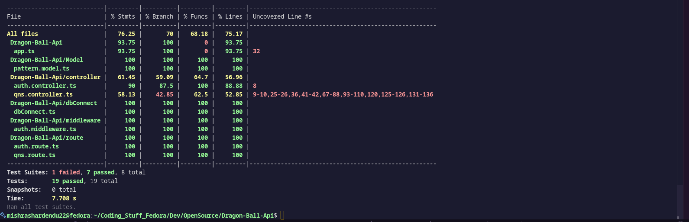

# 🐉 Dragon Ball API

**Note**: The documentation includes examples and an **Ask-AI chat bot** to help you explore the API easily!  
**PR**: [Keploy API Collection](https://github.com/keploy/public-apis-collection/pull/105)
**Live Demo**: [Dragon Ball API](https://www.youtube.com/watch?v=9HNClzXRqf4)

**Love Dragon Ball?** This API is built for fans! Access, manage, and update Dragon Ball trivia with our Express-based custom REST API.

<p align="center">
  <a href="https://shardendu-mishra-documentation-dragon-ball-api.vercel.app" target="_blank">
    
  </a>
  <a href="https://dragon-ball-api-grlr.onrender.com/" target="_blank">
    
  </a>
</p>

---

## ⚙️ Features

- Built using **Express.js** & **TypeScript**
- **MongoDB** backend with **Mongoose**
- **JWT-based** secured endpoints
- Auto-generated **OpenAPI schema**
- Tested via **Keploy** (AI-powered API testing)
- Integrated with **GitHub Actions** CI/CD
- Full **CRUD support** for managing questions
- Swagger-compatible OpenAPI spec
- Nextra-based documentation site

---

## 📍 API Endpoints

| Method | Endpoint               | Description                            | Authentication |
|--------|------------------------|----------------------------------------|----------------|
| GET    | `/`                    | Welcome page with docs link            | No             |
| GET    | `/random`              | Get a random question                  | No             |
| GET    | `/question/:id`        | Get a question by ID                   | No             |
| GET    | `/series/:series`      | Get questions by series                | No             |
| POST   | `/add`                 | Add a new question                     | No             |
| PUT    | `/question/:id`        | Full update of a question by ID        | No             |
| PATCH  | `/question/:id`        | Partial update of a question by ID     | No             |
| DELETE | `/question/:id`        | Delete a question by ID                | Yes (Admin)    |
| DELETE | `/delete`              | Delete all questions                   | Yes (Admin)    |
| POST   | `/GetTokenAdmin`       | Get JWT token for admin actions        | No             |

---

## 🧪 API Testing with Keploy

- ✅ OpenAPI schema auto-generated
- ✅ Curl command-based testing
- ✅ Test cases captured via traffic
- ✅ Integrated into CI/CD

### 📷 Test Results



---

## 🛠 Tech Stack

- **Express.js** - Node.js framework
- **TypeScript** - Type-safe development
- **MongoDB** - NoSQL database
- **JWT** - Secure token authentication
- **Keploy** - AI-powered API testing
- **GitHub Actions** - CI/CD automation
- **Nextra** - Docs generation

---

## 🧩 Project Setup

```bash
git clone https://github.com/shardendu-mishra/dragon-ball-api.git
cd dragon-ball-api
npm install
````

### Set Env Vars

```env
ADMIN_USERNAME=your_admin_username
ADMIN_PASSWORD=your_admin_password
JWT_SECRET=your_jwt_secret
MONGODB_URI=your_mongodb_uri
```

### Run Locally

```bash
npm run start
```

---

## 🔁 CI/CD

GitHub Actions runs Keploy tests on every push.
See `.github/workflows/keploy.yml`

---

## 📜 OpenAPI Schema

Auto-generated using Swagger JSDoc annotations.
Available at `GET /swagger` (if implemented) or in [`swagger.yaml`](./swagger.yaml)

---

## 🔗 Useful Links

* 📘 [API Docs](https://shardendu-mishra-documentation-dragon-ball-api.vercel.app)
* 🌐 [Live API](https://dragon-ball-api-grlr.onrender.com)

---

## 🤝 Contributing

Open PRs and suggestions are welcome.

---

## 👤 Author

**Shardendu Mishra**
GitHub: [@ShardenduMishra22](https://github.com/ShardenduMishra22)

---
